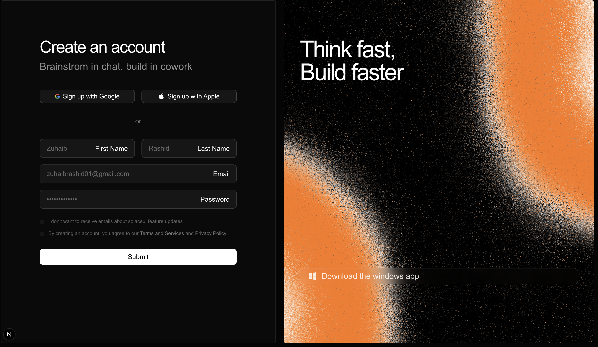

# Auth Section 1

  

A gorgeous, highly-converting split-screen authentication component layout built for Next.js.

## Features
- **Split-screen layout**: A classic and effective dual-pane setup featuring a minimal form block on one side and a beautiful visual presentation on the other.
- **Grain Gradient Shaders**: Utilizing `@paper-design/shaders-react` for a fluid, beautiful animated mesh gradient that acts as a stunning billboard.
- **Tailwind Ready**: Works perfectly with Tailwind's dark/light modes and responsive grids.
- **Form UI Elements**: Fully styled native fields, checkboxes, and social auth buttons with brand icons.

## Author
Zuhaib Rashid (@zuhaib-dev)
