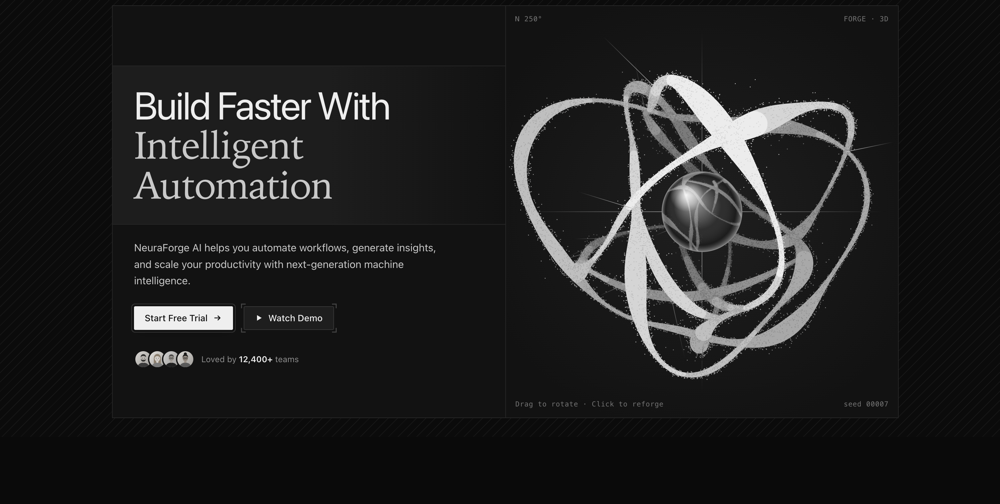

# 🪐 Ink Orbit Hero

  

A stunning hero section featuring a generative 3D ink sculpture that responds to drag, tilt, and click gestures. Built entirely using HTML5 Canvas and React with zero external dependencies.

## Features
- Hardware-accelerated HTML5 Canvas rendering for the 3D sculpture
- Smooth, responsive morphing animations
- Interactive tooltips, live terminal-style demo modals, and click handlers
- Fully isolated component with zero external dependencies (React only)
- Includes dynamic text cycling, glassmorphic UI elements, and drawn portraits
