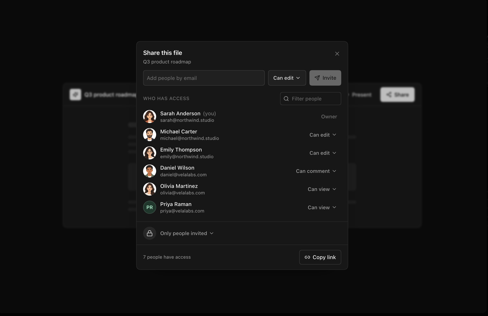

# Share File Dialog

  

A highly-detailed, highly-polished share file dialog modal built for Next.js, featuring smooth Framer Motion animations.

## Features
- **Comprehensive UX**: A tokenized email field that validates addresses instantly, preventing failed submits.
- **Micro-interactions**: Pending invites land smoothly, toast messages appear flawlessly for copied links or sent invitations without breaking flow. 
- **Squircle Corners**: True iOS-style continuous corners using CSS `corner-shape: squircle`.
- **Framer Motion**: Delightful, physics-based spring animations for opening menus, removing users, and displaying toasts.

## Author
Zuhaib Rashid (@zuhaib-dev)
