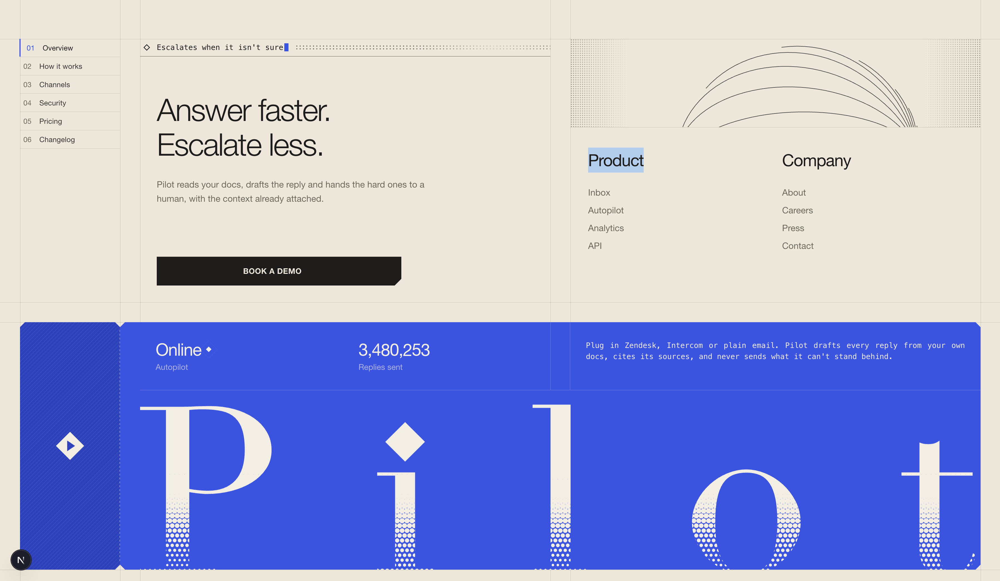

# Ticket Stub Footer

  

A dark, hairline-ruled closing section for an ops product, with the brand printed on an orange ticket.

## Features
- **Globe**: A slowly turning globe of meridians with orange tickets flying over it.
- **Stub**: An orange ticket with a punchable stub, a live agent status, and a rolling "tickets solved" odometer.
- **Wordmark**: A full-width serif wordmark whose foot dissolves into a halftone. Point at the wordmark and it breaks into dots under the pointer; click and a ripple runs through it.

## Author
Zuhaib Rashid (@zuhaib-dev)
